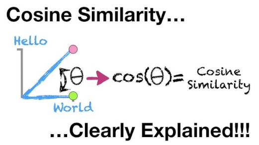
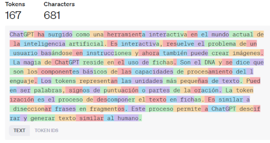

 

# Especialización en Inteligencia Artificial

# Trabajo Práctico Integrador

# Procesamiento de Lenguaje Natural
---

## Alumno:
   - Jorge Valdez

## Contenido

### Desafio 1: Similaridad coseno

Empleando un dataset en ingles, se midio la similaridad entre los documentos usando la similaridad coseno.

### Desafío 2: Embeddings de caracteres y palabras

[Embeddings de palabras](desafio_2/desafio_2.ipynb) 
#### Objetivo
Empleando como documento un libro escrito en español se generaron embeddings de caracteres y palabras.

### Desafío 3: Tokenización

- [Preprocesamiento de datos](desafio_3/1_preprocesamiento.ipynb) 
- [Modelo Lenguaje Char](desafio_3/2_modelo_lenguaje_char.ipynb) 
- [Modelo Lenguaje Word](desafio_3/2_modelo_lenguaje_word.ipynb) 

#### Objetivo
Empleando como documento un libro escrito en español se generó la tokenización de caractéres y palabras.

### Desafío 4: LSTM Bot QA

- [LSTM Bot QA](desafio_4/desafio_4_bot.ipynb) 

#### Objetivo
Utilizando datos disponibles del challenge ConvAI2 (Conversational Intelligence Challenge 2) de conversaciones en inglés se contruiyó un BOT para responder a preguntas del usuario (QA).

### Desafío 5: Análisis de sentimientos usando Bert

[Bert Sentiment Analysis](desafio_5/desafio_5_bert_sentiment_analysis.ipynb) 
#### Objetivo
Empleando el modelo preentrenado de BERR se implemento una clasificación de reviews de aplicaciones basados en los sentimientos de los usuarios.